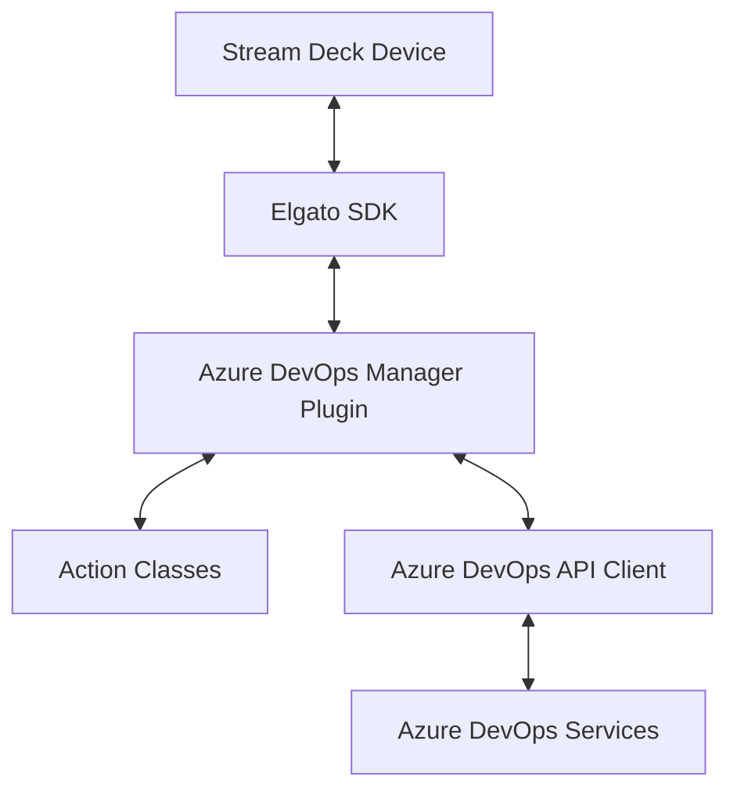
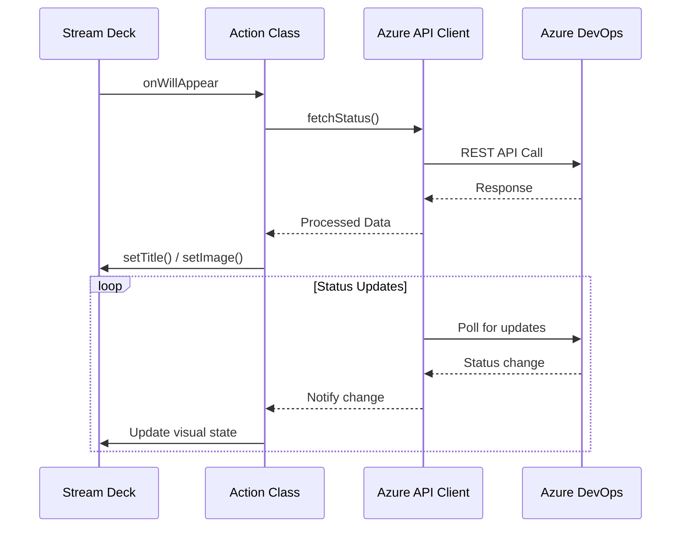
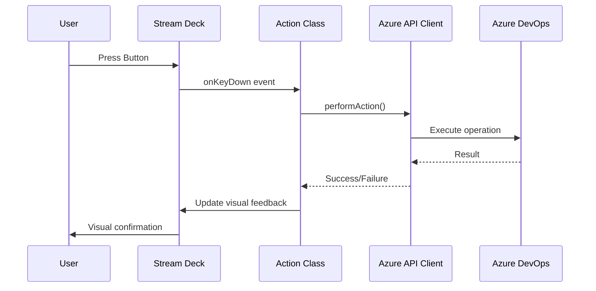
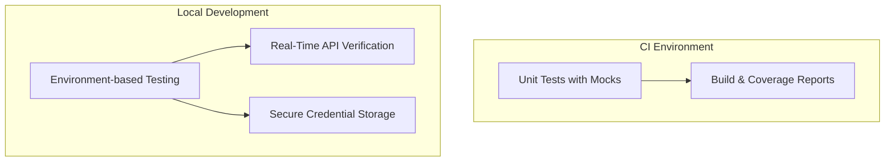

# System Patterns: Azure DevOps Manager

## Architecture Overview

The Azure DevOps Manager is structured as a Stream Deck plugin based on Elgato's SDK. Its architecture follows these key patterns:

## Key Components

### 1. Stream Deck Plugin Core

- Entry point that registers all actions
- Handles communication with the Stream Deck software
- Manages logging and global state

### 2. Action Classes

- Each Stream Deck button action is implemented as a class
- Actions extend the SingletonAction or Action base classes from the Elgato SDK
- Implemented: PipelineMonitor (monitors pipeline status with real-time updates)
- Future actions will include PRTracker, etc.

### 3. Settings Management

- Each action can have its own settings
- Settings are persisted by the Stream Deck software
- Typed interfaces define the shape of settings objects

### 4. Event Handling

- Event-driven architecture following the Elgato SDK patterns
- Key events include:
  - onWillAppear: When an action becomes visible
  - onKeyDown: When a button is pressed
  - onKeyUp: When a button is released
  - onDialRotate: For rotary encoders (if applicable)

### 5. Azure DevOps Integration

- API Client for Azure DevOps services (implemented in azureDevOpsClient.ts)
- Authentication via Personal Access Tokens (PAT)
- Polling-based status updates (implemented in PipelineMonitor)
- Cached responses to minimize API calls (implemented in API client)
- Error handling with retry logic

## Data Flow Patterns

### Button State Updates

### User Interaction

## Design Patterns

1. **Singleton Pattern**
   - Each action is a singleton class
   - Ensures consistent state management

2. **Observer Pattern**
   - Actions observe API client for status changes
   - UI updates in response to data changes

3. **Decorator Pattern**
   - TypeScript decorators used for action registration
   - Example: `@action({ UUID: "com.sshadows.azure-devops-manager.pipeline-monitor" })`

4. **Command Pattern**
   - Each button press encapsulates a command
   - Commands are executed against the Azure DevOps API

5. **Factory Pattern** (Planned)
   - Dynamic creation of action instances
   - Support for multiple action types

6. **Structured Logging Pattern**
   - Using Stream Deck's built-in logger (`streamDeck.logger`) for all diagnostic output
   - Standardized log levels (`info`, `warn`, `error`) for better filtering
   - Detailed step-by-step logging for complex operations like connection testing
   - Avoids direct use of `console.log` for better integration with Stream Deck's logging system

## Guiding Principles

The project adheres to SOLID principles to ensure the code is maintainable, extensible, and robust:

1. **Single Responsibility Principle**
   - Each class has a single responsibility
   - Action classes focus solely on their specific functionality
   - Separation of concerns between UI, business logic, and API communication

2. **Open/Closed Principle**
   - Components are open for extension but closed for modification
   - New actions can be added without changing existing code
   - Plugin architecture allows for adding new features without core changes

3. **Liskov Substitution Principle**
   - Derived classes can substitute their base classes
   - All action implementations maintain the contract of their base classes
   - Consistent behavior across different action types

4. **Interface Segregation Principle**
   - Clients should not depend on interfaces they don't use
   - TypeScript interfaces are kept focused and specific
   - Settings interfaces are tailored to each action's needs

5. **Dependency Inversion Principle**
   - High-level modules don't depend on low-level modules, both depend on abstractions
   - API client interfaces are used rather than concrete implementations
   - Dependency injection used where appropriate

## Testing Patterns

### API Testing Strategy

1. **Unit Testing**
   - Mock-based testing for API client and actions in CI environment
   - Tests for PipelineMonitor action with appropriate mocks
   - Tests run against known fixtures with expected responses
   - Comprehensive error handling tests

2. **Environment-based Testing**
   - Local testing using `.env.test` for credential storage
   - While the plugin uses Stream Deck secure storage, development uses `.env.test`
   - `.gitignore` patterns to protect credentials (`.env*` with exception for template files)
   - Pure JavaScript test scripts to avoid module compatibility issues
   - Test against real Azure DevOps instances for verification

3. **Integration Testing**
   - Verify the interoperation of API client and Settings Manager
   - Ensure proper data flow between components

## Future Architecture Considerations

1. **Caching Layer**
   - Implement efficient caching to reduce API calls
   - Store frequently accessed data locally

2. **Background Service**
   - Consider a background service for continuous status monitoring
   - Push updates to the Stream Deck UI when changes occur

3. **Multiple Organization Support**
   - Architecture should scale to support multiple Azure DevOps organizations

4. **Offline Mode**
   - Graceful degradation when Azure DevOps is unreachable
   - Clear visual indicators of connectivity status
